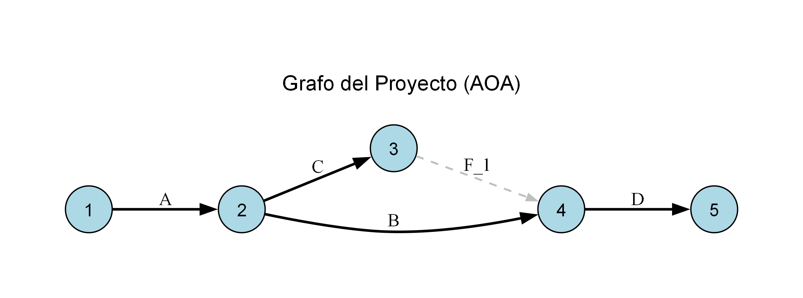
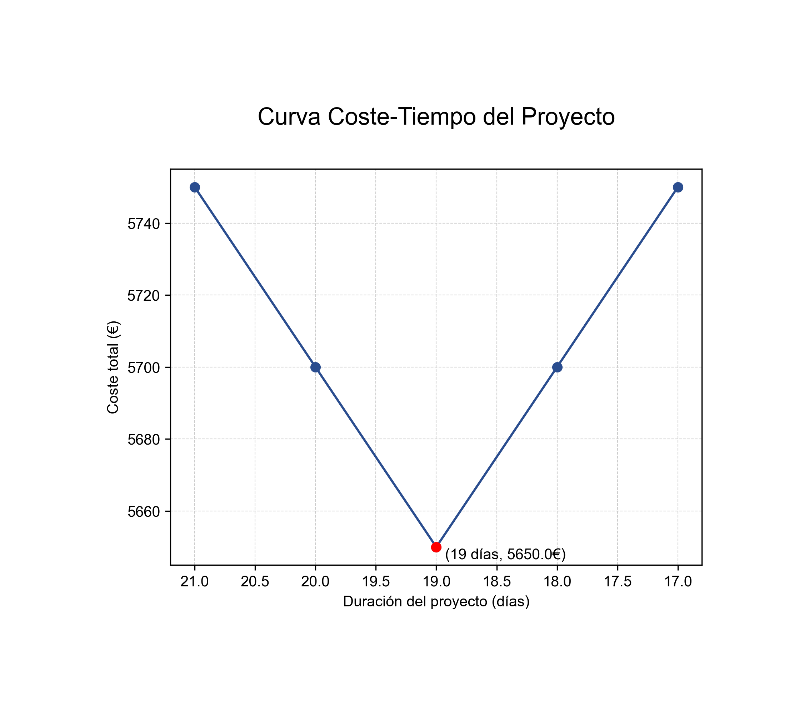
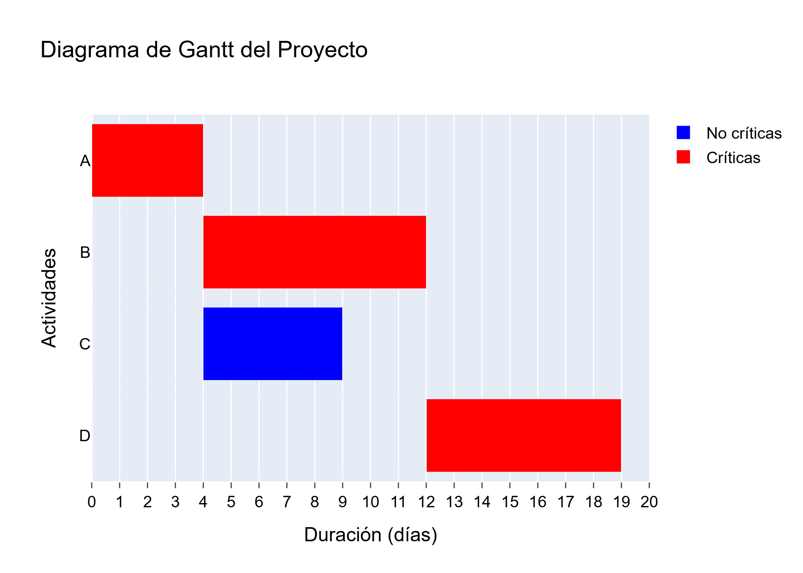

# CPM Extremo — Análisis Coste-Tiempo de Proyectos

[](https://github.com/LuciaCero/CPM-Extremo/actions/workflows/ci.yml)
[](https://www.python.org/)
[](LICENSE)
[](https://networkx.org/)
[](https://graphviz.org/)

Implementación completa del **método CPM extremo** (*crashing* del camino crítico) con análisis coste-tiempo. A partir de una tabla de actividades en Excel, el programa construye el grafo AOA del proyecto, calcula el camino crítico, reduce iterativamente las duraciones buscando el coste total mínimo, y genera toda la documentación del proceso: gráficos y un informe LaTeX con cada cálculo desarrollado paso a paso.

> Desarrollado como proyecto para la asignatura *Planificación de Proyectos y Análisis de Riesgos*.

---

## Tabla de contenidos

- [¿Qué hace?](#qué-hace)
- [Ejemplo de salida](#ejemplo-de-salida)
- [Requisitos del sistema](#requisitos-del-sistema)
- [Instalación](#instalación)
- [Uso](#uso)
- [Formato del Excel de entrada](#formato-del-excel-de-entrada)
- [Salidas generadas](#salidas-generadas)
- [Estructura del proyecto](#estructura-del-proyecto)
- [Cómo funciona el algoritmo](#cómo-funciona-el-algoritmo)
- [Notas y limitaciones](#notas-y-limitaciones)
- [Licencia](#licencia)

---

## ¿Qué hace?

| Etapa | Descripción |
|---|---|
| **Lectura** | Parsea el Excel de entrada: duraciones normal/extrema, costes normal/extremo, costes indirectos y matriz de dependencias. |
| **Grafo AOA** | Construye el grafo *Activity-on-Arrow*, inserta las actividades ficticias necesarias y lo simplifica eliminando nodos redundantes. |
| **CPM clásico** | Calcula *Early* y *Last* de cada nodo, holguras totales, actividades críticas y todos los caminos críticos. |
| **CPM extremo** | Reduce iterativamente en 1 día la actividad crítica de menor pendiente de coste, recalculando todo el CPM en cada paso. |
| **Coste-tiempo** | Evalúa coste directo + indirecto en cada iteración y localiza el punto óptimo (coste total mínimo). |
| **Documentación** | Exporta grafo AOA, diagrama de Gantt, curva coste-tiempo y un informe LaTeX con todas las fórmulas desarrolladas. |

Un detalle que diferencia este proyecto de una implementación mínima: **cada cálculo se registra simbólica y numéricamente**. El informe no muestra solo el resultado `E4 = 14`, sino la expresión completa `E4 = Max{E2 + B, E3 + C} = Max{6 + 8, 6 + 5} = Max{14, 11} = 14`, lo que permite corregir el ejercicio a mano y verificar cada paso.

---

## Ejemplo de salida

Ejecutando `inputs/ejemplo1.xlsx`:

| Grafo AOA | Curva coste-tiempo |
|:---:|:---:|
|  |  |
| *Actividades ficticias en trazo discontinuo* | *Punto óptimo marcado en rojo* |



*Diagrama de Gantt de la iteración óptima: rojo = actividad crítica, azul = no crítica.*

El informe LaTeX completo de este ejemplo está en [`output/ejemplo1/output_pert.txt`](output/ejemplo1/output_pert.txt).

---

## Requisitos del sistema

| Requisito | Versión | Para qué |
|---|---|---|
| **Python** | 3.12 | Intérprete del proyecto. |
| **Graphviz** | 2.4+ | Motor de dibujo que usa `pygraphviz` para renderizar el grafo AOA. |
| **Kaleido** | 0.2+ | Exportación de las figuras de Plotly a PNG (se instala vía `pip`). |

### Instalar Graphviz

Graphviz es un binario del sistema, **no se instala con `pip`**. `pygraphviz` fallará al compilar si no está presente.

<details>
<summary><strong>Windows</strong></summary>

```powershell
winget install graphviz
```

O descargando el instalador desde [graphviz.org/download](https://graphviz.org/download/). Importante: marcar la opción **Add Graphviz to the system PATH** durante la instalación.

Si `pip install pygraphviz` sigue fallando, hay que indicarle dónde está Graphviz. Ver las [instrucciones oficiales para Windows](https://pygraphviz.github.io/documentation/stable/install.html#windows).

</details>

<details>
<summary><strong>macOS</strong></summary>

```bash
brew install graphviz
```

</details>

<details>
<summary><strong>Linux (Debian/Ubuntu)</strong></summary>

```bash
sudo apt-get install graphviz graphviz-dev
```

</details>

Verificar que quedó accesible:

```bash
dot -V
```

---

## Instalación

### 1. Clonar el repositorio

```bash
git clone https://github.com/LuciaCero/CPM-Extremo.git
```

### 2. Crear el entorno virtual

En Windows, si hay varias versiones de Python instaladas, conviene forzar la 3.12:

```powershell
py -3.12 -m venv venv
```

```powershell
venv\Scripts\Activate.ps1
```

En macOS o Linux:

```bash
python3.12 -m venv venv && source venv/bin/activate
```

### 3. Instalar dependencias

```bash
pip install -r requirements.txt
```

### 4. Instalar el proyecto

Recomendado: instalación editable. Registra el comando `cpm-extremo` y resuelve los imports sin tener que tocar el `PYTHONPATH`.

```bash
pip install -e .
```

<details>
<summary>Alternativa sin instalar: configurar <code>PYTHONPATH</code> a mano</summary>

Desde la raíz del proyecto, en cada sesión nueva de terminal:

```powershell
$env:PYTHONPATH = "$PWD\src"
```

En macOS o Linux:

```bash
export PYTHONPATH="$PWD/src"
```

</details>

---

## Uso

```bash
cpm-extremo inputs/ejemplo1.xlsx
```

O como módulo, sin instalar el paquete:

```bash
python -m cpm_extremo.main inputs/ejemplo1.xlsx
```

El programa recibe **un único argumento**: la ruta al Excel de entrada. Los resultados se escriben en `output/<nombre_del_excel>/`, creando la carpeta si no existe y sobrescribiendo ejecuciones anteriores del mismo input.

### Procesar todos los ejemplos de golpe

En Windows (PowerShell):

```powershell
Get-ChildItem inputs\*.xlsx | ForEach-Object { cpm-extremo $_.FullName }
```

En macOS o Linux:

```bash
for f in inputs/*.xlsx; do cpm-extremo "$f"; done
```

---

## Formato del Excel de entrada

El Excel debe respetar una estructura **de posiciones fijas**: el lector localiza los datos por número de fila, no por etiqueta. La forma más segura de crear un input nuevo es duplicar [`inputs/ejemplo1.xlsx`](inputs/ejemplo1.xlsx) y sobrescribir los valores.

La estructura completa está documentada en **[docs/FORMATO_INPUT.md](docs/FORMATO_INPUT.md)**. Resumen:

| Fila (0-indexada) | Contenido |
|---|---|
| `0` | **Duración normal** (`Dn`) de cada actividad. La fila de cabecera lleva los nombres (`A`, `B`, `C`...). |
| `1` | **Duración extrema** (`De`): mínimo técnico al que puede reducirse la actividad. |
| `2`–`3` | Separador y cabecera de la sección de costes. |
| `4` | **Coste normal** (`Cn`): coste de la actividad a duración normal. |
| `5` | **Coste extremo** (`Ce`): coste de la actividad a duración extrema. |
| `6`–`7` | Separador y cabecera de costes indirectos. |
| `8` | **Costes indirectos** en formato `A + B·X`: primera columna el coste fijo `A`, segunda el coste diario `B`. Una celda vacía equivale a 0. |
| `9` | Separador. |
| `10` | Cabecera `Dependencias` más los nombres de las actividades. |
| `11` en adelante | **Matriz de precedencias**: un `1` en la celda (fila `A`, columna `B`) significa que A es predecesora de B. Celdas vacías indican que no hay relación. |

### Convenciones

- El número de actividades se deduce contando los valores no vacíos de la fila 0.
- Los **sucesores se calculan automáticamente** invirtiendo la matriz de predecesores; no hay que declararlos.
- Las duraciones se expresan en **días**; los costes, en **euros**.
- Los decimales usan **punto**, no coma.
- Las dependencias no pueden formar ciclos: el programa valida el grafo y aborta con un error si detecta uno.

---

## Salidas generadas

Cada ejecución produce cuatro archivos en `output/<nombre_del_excel>/`:

| Archivo | Contenido |
|---|---|
| `output_graph.png` | Grafo AOA renderizado con Graphviz. Actividades reales en línea continua, ficticias en discontinuo gris. |
| `output_gantt.png` | Diagrama de Gantt de la **iteración óptima**. Barras rojas para actividades críticas, azules para el resto. |
| `output_coste-tiempo.png` | Curva coste-tiempo con el punto óptimo resaltado y anotado. Eje X invertido, con la duración decreciente. |
| `output_pert.txt` | Informe LaTeX completo. Ver desglose abajo. |

### El informe `output_pert.txt`

Es un documento LaTeX autónomo (clase `llncs`, con `tikz` y `pgfplots`) que incluye, **para cada iteración del algoritmo**:

- Tabla de datos de las actividades: `Dn`, `De`, `Cn`, `Ce`, pendientes y dependencias.
- Parámetros de coste indirecto del proyecto.
- Tabla Early/Last de todos los nodos, y el desarrollo simbólico de cada valor.
- Tabla de holguras, y el desarrollo simbólico de cada `Hij`.
- Actividades críticas y todos los caminos críticos.
- Duración del proyecto, con la suma de cada camino crítico desarrollada.
- Coste total, desglosado en coste directo e indirecto.

La iteración óptima aparece marcada explícitamente. Al final, la **curva coste-tiempo dibujada en TikZ**, lista para insertar en un documento académico.

Para compilar el informe hace falta una distribución de LaTeX que incluya la clase `llncs` (la de Springer LNCS):

```bash
cp output/ejemplo1/output_pert.txt informe.tex && pdflatex informe.tex
```

---

## Estructura del proyecto

```
CPM-Extremo/
├── inputs/                          # Excel de entrada (8 ejemplos, de menor a mayor complejidad)
│   ├── ejemplo1.xlsx                #   <- plantilla de referencia (4 actividades)
│   ├── ejemplo2.xlsx
│   ├── ejemplo3.xlsx
│   ├── ejemplo4.xlsx
│   ├── ejemplo5.xlsx
│   ├── ejemplo6.xlsx
│   ├── ejemplo7.xlsx
│   └── ejemplo8.xlsx                #   <- el mas complejo (10 actividades)
│
├── output/                          # Resultados (una subcarpeta por input)
│   └── <nombre_del_excel>/
│       ├── output_graph.png
│       ├── output_gantt.png
│       ├── output_coste-tiempo.png
│       └── output_pert.txt
│
├── docs/
│   ├── FORMATO_INPUT.md             # Especificación detallada del Excel
│   └── ALGORITMO.md                 # Fundamento matemático y pseudocódigo
│
├── src/cpm_extremo/
│   ├── main.py                      # Punto de entrada y orquestación
│   │
│   ├── input/                       # Lectura del Excel
│   │   └── leer_excel.py            #   Parseo y construcción de DataFrames
│   │
│   ├── grafo/                       # Grafo AOA (networkx.DiGraph)
│   │   ├── constructor.py           #   Construcción y validación de ciclos
│   │   ├── reducir.py               #   Simplificación de nodos y ficticias
│   │   ├── actualizar.py            #   Propagación de nuevas duraciones
│   │   └── info.py                  #   Volcado de nodos y actividades a DataFrame
│   │
│   ├── cpm/                         # Lógica del método
│   │   ├── algoritmo.py             #   Bucle principal del CPM extremo
│   │   ├── estado.py                #   Estado inicial (duraciones y costes)
│   │   ├── early_last.py            #   Early y Last por orden topológico
│   │   ├── holguras.py              #   Hij = Lj - Ei - Dij
│   │   ├── camino_critico.py        #   Actividades y caminos críticos
│   │   ├── duracion.py              #   Duración del proyecto
│   │   ├── costes.py                #   Coste directo e indirecto
│   │   ├── pendientes.py            #   Pendiente = (Ce - Cn) / (Dn - De)
│   │   └── reduccion_actividades.py #   Reducción de 1 día con validación
│   │
│   ├── output/                      # Generación de resultados
│   │   ├── grafo_png.py             #   Graphviz
│   │   ├── gantt_png.py             #   Plotly
│   │   ├── coste_tiempo_png.py      #   Matplotlib
│   │   ├── latex_informe.py         #   Informe LaTeX
│   │   └── filesystem.py            #   Gestión de carpetas y rutas
│   │
│   └── shared/
│       └── globales.py              # Registro de los detalles simbólicos de cada cálculo
│
├── pyproject.toml
├── requirements.txt
├── LICENSE
└── README.md
```

---

## Cómo funciona el algoritmo

Explicación completa y pseudocódigo en **[docs/ALGORITMO.md](docs/ALGORITMO.md)**. En resumen:

```
1. Construir el grafo AOA y simplificarlo.
2. Estado inicial: cada actividad a su duración y coste normales (Dn, Cn).
3. Calcular la pendiente de coste de cada actividad:
       pendiente = (Ce - Cn) / (Dn - De)
   Infinita si Dn = De, es decir, si la actividad no admite reducción.

4. REPETIR:
     a. Calcular Early y Last de cada nodo, en orden topológico.
     b. Calcular holguras: Hij = Lj - Ei - Dij.  Es crítica si Hij = 0.
     c. Obtener los caminos críticos y la duración del proyecto.
     d. Calcular el coste total:
            C_total = suma de costes de actividades + (C_fijo + duración * C_diario)
     e. Registrar la iteración en el historial coste-tiempo.
     f. Si el coste ha subido dos veces consecutivas, PARAR.
     g. Elegir la actividad crítica reducible de MENOR pendiente.
        Si no hay ninguna, PARAR.
     h. Reducir su duración en 1 día; su coste aumenta en el valor de su pendiente.
        Si la reducción no es válida, marcar la actividad como no reducible
        y volver a intentarlo con otra.
     i. Propagar las nuevas duraciones al grafo.

5. El óptimo es la iteración de coste total mínimo.
```

### Criterios de parada

El bucle termina por una de dos condiciones:

1. **Dos subidas consecutivas de coste.** Una vez pasado el mínimo, el algoritmo continúa dos iteraciones más para que la curva coste-tiempo muestre con claridad la rama ascendente.
2. **No quedan actividades críticas reducibles**, porque todas están ya a su duración extrema o se marcaron como no reducibles.

### Por qué el óptimo no es siempre el proyecto más corto

Acortar una actividad **aumenta** su coste directo, porque hay que pagar más recursos, pero **reduce** el coste indirecto, porque hay menos días de estructura, alquileres y supervisión. El coste total es la suma de ambos, así que describe una curva en U: baja mientras el ahorro en indirectos supera al sobrecoste en directos, y sube en cuanto se invierte esa relación. El punto óptimo es el fondo de la U.

---

## Notas y limitaciones

- **Las reducciones son de 1 día por iteración.** No se implementa reducción fraccionaria ni por bloques.
- **El camino crítico puede cambiar entre iteraciones**, e incluso puede haber varios simultáneos. El algoritmo lo recalcula desde cero en cada paso, por lo que lo gestiona correctamente.
- **Empates de pendiente:** si dos actividades críticas tienen la misma pendiente mínima, se elige la primera en el orden del DataFrame. Es una decisión arbitraria, pero determinista.
- **Iteraciones extra tras el óptimo:** el historial incluye dos iteraciones más allá del mínimo. Están ahí a propósito, para completar la curva; no son un fallo de convergencia.
- **El formato del Excel es rígido**, con posiciones de fila fijas. Un input mal alineado no produce un error claro, sino resultados incorrectos. Conviene partir siempre del fichero de ejemplo.
- **El grafo AOA no es único.** Distintas construcciones válidas, con distinto número de actividades ficticias, pueden representar el mismo proyecto. Los valores de Early, Last, holguras y duración no cambian, pero la numeración de nodos sí puede diferir de la de una solución hecha a mano.

### Sobre los datos de `inputs/`

Los ficheros de `inputs/` contienen datos **completamente ficticios** procedentes de ejercicios de clase. Están incluidos únicamente como ejemplos del formato de entrada y para poder reproducir las salidas del repositorio. No recogen información real de ningún proyecto, empresa ni persona.

---

## Licencia

Distribuido bajo licencia MIT. Ver [LICENSE](LICENSE) para el texto completo.
